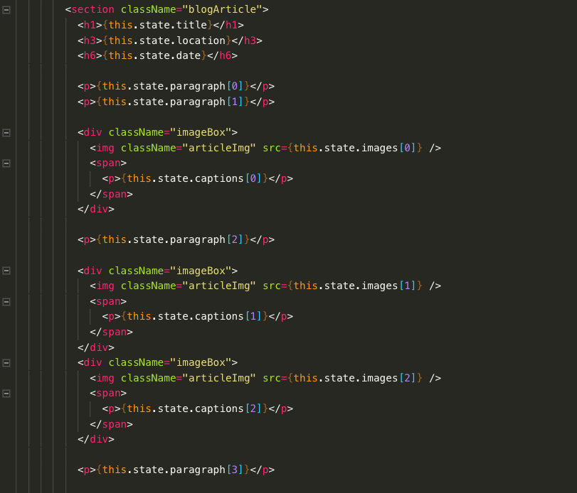

# indianahames
<h1 style="text-align: center;">INDIANA HAMES</h1>

<h3><strong>AIM</strong></h3>

To build a blog site that had potential to be used as a framework, including the following functionality:

<ol>
    <li>Use state to manage content</li>
    <li>Full mobile responsiveness</li>
    <li>Option to filter and search for blog posts</li>
    <li>Photo captions on hover (destop) and on tap (mobile)</li>
</ol>

<h3><strong>TECH STACK</strong></h3>
<ul>
    <li>React</li>
    <li>SCSS</li>
    <li>Wepback</li>
    <li>BabelRC</li>
    <li>Git</li>
    <li>Yarn</li>
</ul>

<h3><strong>METHOD - Each Blog</strong></h3>

My main priority was to use state to manage the content. In my example, each blog as a post has a title, date and location as well as images, paragraphs and captions. All of these would be stored in state, with the latter trio stored in arrays as seen below. 

 This became the template state for any blog post added. Once the content itself had all been added to state it was then a case of manipulating the data in the render. Although a touch fiddly trying to remember where you were upto in regard to the content, I found this an effective way to move images and paragraphs up and down the page as needed. 

 Some images have captions and some don't, and I felt that having captions just written below the images could look inconsistent. With this in mind, I used a simple CSS transition to allow the viewer to hover over a photo and view a caption if it exists. The examples and code are below.

<h3><strong>METHOD - Home Page</strong></h3>

All in all I used very similar techniques here. I wanted each blog post to a 'blog card' and formatted the same as all the others, while using the data in state to make each unique. I would do this by storing all the data in state and iterating over it with a map function. Each blog already had a title, location and date but I also added two more keys. Firstly I added 'background' to be used as a className, giving each 'blogcard' it's own unique background. Secondly I added 'url' as I wanted each 'blogcard' to be a link in itself, so I could use this as the path. The code snippets below show how I put this together. 

I think it's important to note that using backticks and curly braces to concatinate in React can be a tricky task, so although confident in the theory it did take some trial and error to finally get it right. 

 For me this is an ongoing project, I will be added capability to filter soon 

